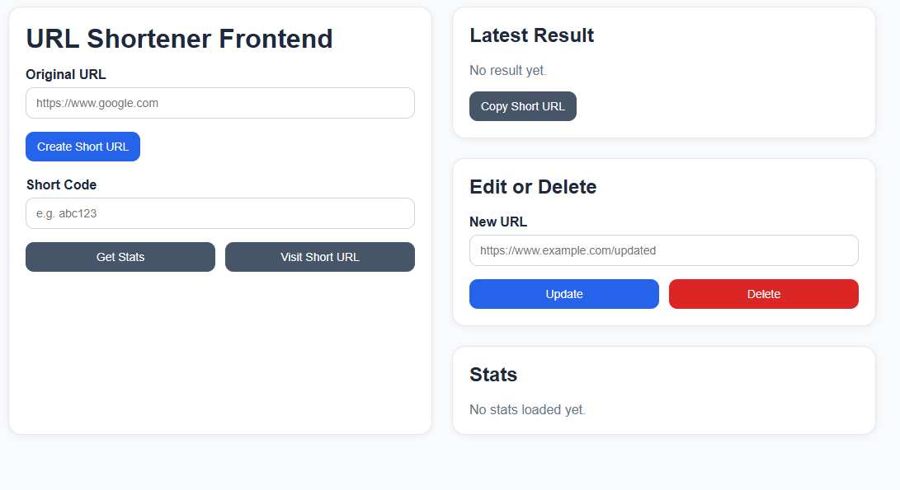
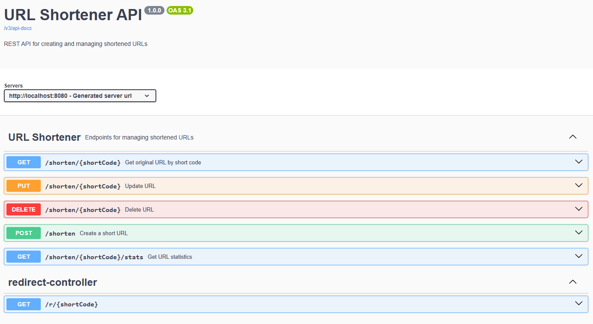

# URL Shortener API


A RESTful **URL Shortening API** built with **Spring Boot**, demonstrating production-style backend architecture including layered design, URL redirection, statistics tracking, Docker containerization, and comprehensive testing.

This project is based on the backend challenge from **roadmap.sh**:

https://roadmap.sh/projects/url-shortening-service

---

# Table of Contents

- [Features](#features)
- [Tech Stack](#tech-stack)
- [Architecture](#architecture)
- [Project Structure](#project-structure)
- [Screenshots](#screenshots)
- [Prerequisites](#prerequisites)
- [Getting Started](#getting-started)
- [Docker Setup](#docker-setup)
- [API Endpoints](#api-endpoints)
- [API Documentation](#api-documentation)
- [Testing](#testing)
- [Environment Variables](#environment-variables)
- [Future Improvements](#future-improvements)

---

# Features

## URL Shortening

- Convert long URLs into short shareable links
- Automatically generate unique short codes
- Store URL mappings persistently in MySQL
- Return a shortened URL ready for redirection

Example:
```text
https://www.example.com/some/very/long/url

↓
http://localhost:8080/abc123
```

---

## URL Redirection

Short URLs redirect users to the original destination.

Example:
```text
GET /abc123
→ Redirects to https://www.example.com/some/very/long/url
```

This behavior mimics real-world services such as **Bitly** or **TinyURL**.

---

## URL Management

Full lifecycle management for shortened URLs:

- Create short URLs
- Retrieve URL information
- Update existing URLs
- Delete URLs

---

## URL Statistics

Retrieve statistics for each shortened URL including:

- original URL
- short code
- creation timestamp
- update timestamp
- number of accesses

---

## Simple Frontend Interface

A minimal frontend interface is included to interact with the API.

Users can:

- Create short URLs
- Visit shortened URLs
- Retrieve statistics
- Update URLs
- Delete URLs

---

# Tech Stack

| Layer | Technology |
|---|---|
| Language | Java 21 + |
| Framework | Spring Boot 4.x |
| Web | Spring Web MVC |
| Database | MySQL + Spring Data JPA |
| Documentation | Swagger / OpenAPI |
| Containerization | Docker + Docker Compose |
| Testing | JUnit, Mockito, MockMvc, H2 |
| Build Tool | Maven |

---

# Architecture

The application follows a layered architecture separating request handling, business logic, and data persistence.
```text
Client / Frontend
↓
Controller → Handles HTTP requests/responses
↓
Service → Business logic
↓
Repository → Database interaction (Spring Data JPA)
↓
Database → MySQL (production) / H2 (tests)
```

DTOs are used throughout to separate API models from database entities.

---

# Project Structure
```text
src/
├── main/
│   └── java/com/toby/urlshortener/
│     ├── controller/ # REST controllers
│     ├── service/ # Business logic
│     ├── repository/ # Spring Data JPA repository
│     ├── model/ # Database entity
│     ├── dto/ # Request / response models
│     ├── config/ # Application configuration
│     ├── util/ # Utility classes
│     └── exception/ # Global exception handling
└── test/
    └── java/com/toby/urlshortener/
        ├── controller/ # Controller tests (MockMvc)
        └── service/ # Unit tests (Mockito)
```
---

# Screenshots

## Frontend Interface

<!-- Replace with your uploaded screenshot -->



---

## Swagger UI

<!-- Replace with your uploaded screenshot -->



---

# Prerequisites

- Java 21+
- MySQL 8+
- Maven 3.8+
- Docker (optional)

---

# Getting Started

### 1. Clone the repository
```bash
git clone https://github.com/toby-yip-518/url-shortener.git
cd url-shortener
```
### 2. Create the database
```bash
CREATE DATABASE url_shortener_db;
```
### 3. Configure application.properties
```bash
spring.datasource.url=jdbc:mysql://localhost:3306/url_shortener_db
spring.datasource.username=your_db_user
spring.datasource.password=your_db_password
```
### 4. Build and run
```bash
mvn clean install
mvn spring-boot:run
```
The API will be available at:
```bash
http://localhost:8080
```
# Docker Setup
Run the application using Docker Compose.
```bash
docker compose up --build
```
Once started, the application will be available at:
```bash
http://localhost:8080
```
## API Endpoints

### URLs

| Method | Endpoint | Description |
|--------|----------|-------------|
| POST | `/api/urls` | Create a shortened URL |
| GET | `/api/urls/{shortCode}` | Retrieve stored URL information |
| PUT | `/api/urls/{shortCode}` | Update the original URL |
| DELETE | `/api/urls/{shortCode}` | Delete a short URL |
| GET | `/api/urls/{shortCode}/stats` | Retrieve statistics for a short URL |

---

### Redirect

| Method | Endpoint | Description |
|--------|----------|-------------|
| GET | `/{shortCode}` | Redirect to the original URL |

**Example:**

```text
GET /abc123
Response:
```

```
HTTP 302 Found
Location: https://www.example.com/some/long/url
```

---

### Create Short URL

**Example request body:**

```json
{
  "url": "https://www.example.com/some/very/long/url"
}
```

**Example response:**

```json
{
  "id": 1,
  "url": "https://www.example.com/some/very/long/url",
  "shortCode": "abc123",
  "shortUrl": "http://localhost:8080/abc123",
  "createdAt": "2026-03-16T12:00:00",
  "updatedAt": "2026-03-16T12:00:00"
}
```

---

### Get URL Statistics

**Example response:**

```json
{
  "id": 1,
  "url": "https://www.example.com/some/very/long/url",
  "shortCode": "abc123",
  "createdAt": "2026-03-16T12:00:00",
  "updatedAt": "2026-03-16T12:00:00",
  "accessCount": 10
}
```

---

## API Documentation

Swagger UI is available at:

```
http://localhost:8080/swagger-ui/index.html
```

OpenAPI JSON spec:

```
http://localhost:8080/v3/api-docs
```

---

## Testing

The project includes both unit tests and controller tests.

```bash
# Run all tests
mvn test

# Run a specific test class
mvn test -Dtest=UrlServiceImplTest
```

### Unit Tests

Service layer tested in isolation using Mockito — no database or Spring context required.

### Controller Tests

Full request flow tested using MockMvc:

```
HTTP Request
→ Controller
→ Service
→ Response
```

---

## Environment Variables

| Variable | Description | Example |
|----------|-------------|---------|
| `SPRING_DATASOURCE_URL` | MySQL connection string | `jdbc:mysql://localhost:3306/url_shortener_db` |
| `SPRING_DATASOURCE_USERNAME` | Database username | `root` |
| `SPRING_DATASOURCE_PASSWORD` | Database password | `secret` |

---

## Future Improvements

- [ ] Custom short codes
- [ ] Link expiration support
- [ ] Redis caching for frequently accessed URLs
- [ ] Rate limiting
- [ ] Click analytics / analytics dashboard
- [ ] CI/CD pipeline (GitHub Actions)
- [ ] Cloud deployment (AWS / GCP / Azure)

---

## Learning Focus

This project demonstrates:

- RESTful API design patterns
- URL shortening system design
- Layered backend architecture with DTOs
- URL redirection handling
- Swagger/OpenAPI API documentation
- Unit testing with Mockito
- Controller testing with MockMvc
- Dockerized backend services
